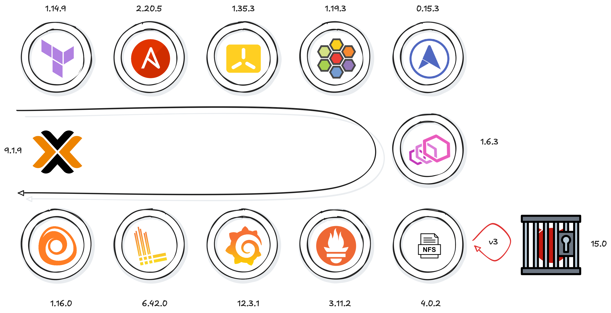

#+title: Dynperf

* Introduction
** Abstract
This platform aims to automate the creation of a cluster by integrating the most suitable tools for continuously monitoring its operation. Another complementary objective is to achieve maximum vendor independence in order to anticipate potential vendor changes and maintain end-to-end control over the architecture.
I chose Proxmox for its simplicity in designing a home lab and for securing access to the various OpenSense virtual machines. I also used WireGuard to manage communication.

* Choices and Beliefs
It’s important to understand that monitoring a cluster involves not only the application layer but also network observability and L3-L7 security.
Although Pixie is a cloud-ready solution by default, choosing a compatible on-premises configuration is not really recommended. The alternative would be to use Tempo for traces, Parca or Prometheus for CPU and memory usage, and Loki for log processing instead of Pixie.

* Timeline
** Introduction
As this is an automated process, the setup is based directly on Terraform for infrastructure as code (IaC) and Ansible for installing each component.
** Platform
[[images/PLATFORM-2026-04-21-1554.svg]]
** Step one

** K3S
I chose k3s to simplify the installation and avoid the complexity of k8s. The tool allows for the creation of one or more masters (1 or 3 in this setup) and one or more workers.
** Cilium
We take advantage of the default installation of eBpf in recent kernels to install Cilium as the CNI. The k3s configuration will require disabling a few parameters such as:
+ flannel-backend=none
+ disable-network-policy
+ disable-kube-proxy
  #+begin_src shell
$ server --advertise-address={{ advertise_address }} \
    --tls-san={{ advertise_address }} \
     --flannel-backend=none \
     --disable-network-policy \
     --disable-kube-proxy \
     --disable=servicelb \
     --disable=local-storage \
     --disable=traefik"
  #+end_src
** MetalLB
Metallb defines the pool of addresses that will be used for certain services, such as the gateway generated by Envoy, for example.
#+begin_src emacs-lisp
- name: Apply the configuration
  kubernetes.core.k8s:
    namespace: metallb-system
    state: present
    definition:
      apiVersion: metallb.io/v1beta1
      kind: IPAddressPool
      metadata:
        name: ingress-pool
        namespace: metallb-system
      spec:
        addresses:
          - "{{ metallb_pool_start }}-{{ metallb_pool_end }}"
#+end_src
** Envoy Gateway
Envoy Gateway will allow me to generate my ingress gateways
** Prometheus
Prometheus, a true metrics aggregator and the right tool for any query. The main Grafana configurations, including data sources, are set up through the Prometheus configuration. This includes Prometheus, Loki, and Tempo.
** Loki-grafana
Loki will allow me to collect the cluster logs.
*** Tempo
Tempo, just for collecting traces
*** Alloy
Alloy simply forwards the logs to Loki and traces to tempo. The dual use of collecting for both Loki and Tempo is justified by the size of the home lab. Tempo is generally paired with OpenTelemetry. While Alloy can replace OT on fairly small configurations, OT cannot replace Alloy.

* Storage
** FreeBSD
In order to use FreeBSD as a storage server, it is necessary to understand certain aspects, such as the differences between Linux and FreeBSD export mappings, local permissions and access security. I prefer Linux for containerisation out of necessity, but I choose FreeBSD for the stability of monolithic servers, such as those used for storage or DNS. However, that's just my personal preference. Access security will be handled by FreeBSD (pf.conf), and account isolation for Network File System (NFS) will be managed via jails (bastille), with the server (nfsd, rpcbind and mountd) running on the host.
** Exports
#+begin_src emacs-lisp
/srv/nfs/spike -maproot=spike -network 192.188.200.0 -mask 255.255.255.0
/srv/nfs/faye -maproot=faye -network 192.188.200.0 -mask 255.255.255.0
/srv/nfs/crew -network 192.188.200.0 -mask 255.255.255.0
/srv/nfs/kube -mapall=nobody -alldirs -network 192.188.200.0 -mask 255.255.255.0
#+end_src
Just focus on the last line (/srv/nfs/kube).
