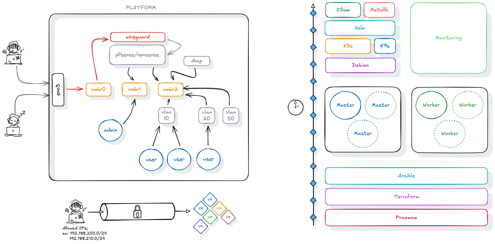

#+title: Just a simple script to build a K3s cluster
#+author: Spike Spiegel

* Introduction
It's just a simple project including the script to build a /K3s/ cluster with
+ k3s
+ k9s
+ Cilium
+ metallb
+ etc..

* Platform

* Proxmox
** Template
I use two types of template in Proxmox to set up my virtual machines.
The first is for the Kubernetes cluster (i.e. the masters and workers). This template is based on a standard Debian (v13) installation.
The second template is for the storage virtual machines and the HLS server. This image is based on a FreeBSD (v15) installation adapted for jails.
Three services are launched automatically:
+ qemu_guest_agent
+ cloudinit
+ openssh
+ pf
+ pflog
To speed up the boot process, I enable
#+begin_src emacs-lisp
$ sysrc -f /boot/loader.conf autoboot_delay=-1
#+end_src
** Pf configuration
#+begin_src emacs-lisp
ext_if="eth0"

set block-policy return
scrub in on $ext_if all fragment reassemble
set skip on lo

table <jails> persist
nat on $ext_if from <jails> to any -> ($ext_if:0)
rdr-anchor "rdr/*"

block in all
pass out quick keep state
antispoof for $ext_if inet
pass in inet proto tcp from any to any port ssh flags S/SA keep state
#+end_src
Just based on bastille pf configuration
* DynPerf
👉 Just follow the [[DYNPERF.org][white rabbit]]
