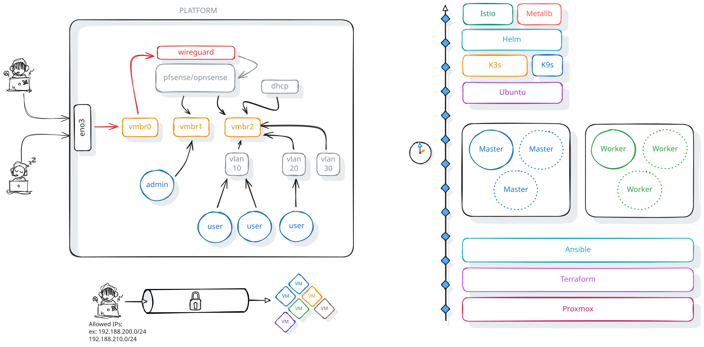

#+title: Just a simple script to build a K3s cluster
#+author: Spike Spiegel

* Introduction
It's just a simple project including the script to build a /K3s/ cluster with
+ istio
+ k9s
+ metallb

* Platform
** Server

* Video
** Script
* Reference
+ [[https://dev.to/naveens16/envoy-sidecar-proxy-mastering-traffic-control-observability-and-autoscaling-in-kubernetes-kcg][Naveen]]
+ 
